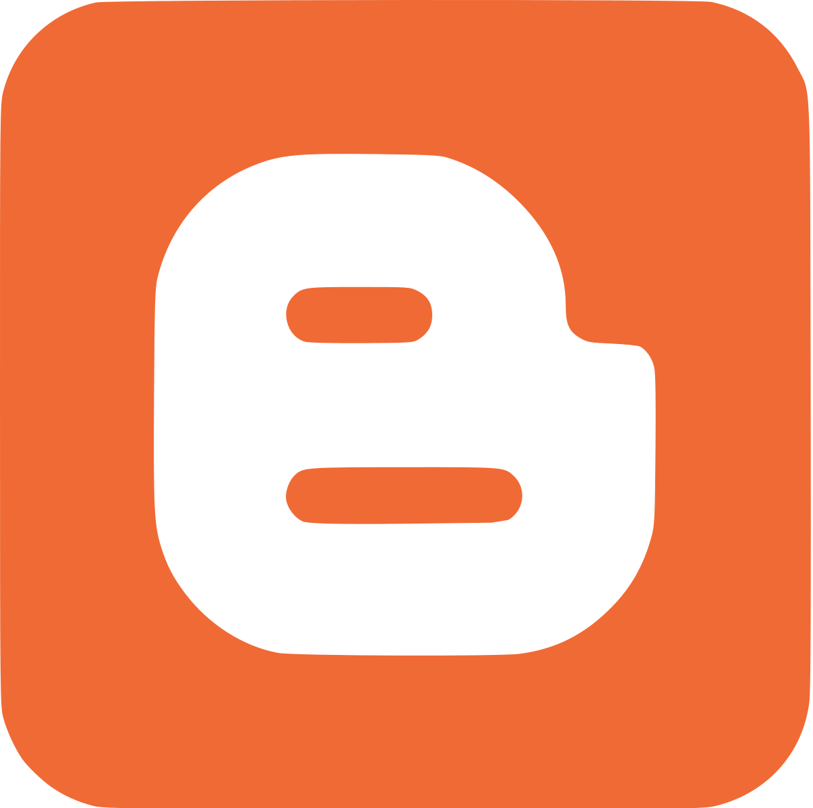

# Witaj na moim blogu o programowaniu!
Znajdziesz tu praktyczne porady, tutoriale i informacje związane z programowaniem.
Nauczysz się pisać kod w wielu różnych językach programowania oraz dowiesz się wielu ciekawostek.

## Języki programowania
Przedstawię ci różne języki programowania, których się uczyłem oraz pokażę ci przykładowe kody i informacje.
- [C++](#c)
- [Html](#html)
- [Css](#css)
- [Java](#java)
- [PHP](#php)
- [Python](#python)
- [Javascript](#javascript)
- [Kotlin](#kotlin)
- [SQL](#sql)

### C++


```
C++ to wszechstronny, obiektowo zorientowany język 
programowania stworzony przez Bjarne Stroustrupa
w 1985 roku jako rozszerzenie języka C. Jest on 
szeroko stosowany w różnych dziedzinach, od 
systemów operacyjnych, przez aplikacje desktopowe
i mobilne, aż po gry komputerowe i systemy 
wbudowane. Główne cechy języka C++ to wydajność i 
efektywność,  wsparcie dla programowania obiektowego, 
kompatybilność z C, szablony(templates), bibliotego 
standardowa(STL), sterowanie pamięcią oraz obsługa
wyjątków. C++ znajduje zastosowanie w wielu obszarach
technologii: systemy operacyjne, gry komputerowe, 
aplikacje wbudowane oraz aplikacje dekstopowe.
```
### _[Link do strony o C++](./cpp.html)_

### HTML

```
HTML, czyli HyperText Markup Language, jest podstawowym 
językiem używanym do tworzenia i strukturyzacji stron 
internetowych. Został stworzony na początku lat 90. 
przez Tima Berners-Lee, aby umożliwić publikowanie 
dokumentów w sieci World Wide Web. 
HTML nie jest językiem programowania, lecz językiem 
znaczników (markup language), co oznacza, że służy do 
opisywania struktury i treści dokumentów.
Główne Cechy HTML to używanie znaczników (tagów) do 
budowy strony, tworzenie linków do innych stron (<a>),
obsługa obrazów, wideo i audio (, <video>, <audio>),
umożliwia zbieranie danych od użytkowników (<form>),
używa znaczników opisujących części strony 
(<header>, <footer>), dostosowuje strony do różnych 
urządzeń, opisuje, co wyświetlić, nie jak wyświetlić,
jest łatwy do nauki i użycia, oraz zgodny z 
przeglądarkami: działa na wszystkich przeglądarkach,
integruje JavaScript dla interaktywności.
```
### _[Link do strony o HTML](./html.html)_

### CSS

```
CSS, czyli Kaskadowe Arkusze Stylów, to język używany 
do opisu wyglądu i formatowania dokumentów napisanych 
w HTML (oraz XML). CSS pozwala na oddzielenie struktury 
dokumentu (HTML) od jego stylizacji, co upraszcza 
zarządzanie wyglądem stron internetowych i ułatwia ich 
utrzymanie. Został stworzony przez Håkon Wium Lie 
i przedstawiony przez W3C (World Wide Web Consortium) 
w 1996 roku. Główne cechy CSS to  oddzielenie treści od 
stylu, kaskadowość (cascading), czyli pozwolenie na 
stosowanie wielu stylów do jednego elementu, 
responsywność, animacje i przejścia 
oraz elastyczne układy.
```
### _[Link do strony o CSS](./css.html)_

### JAVA

```
Java to wszechstronny, obiektowo zorientowany język 
programowania opracowany przez firmę Sun Microsystems 
(obecnie część Oracle Corporation) i wprowadzony na rynek
w 1995 roku. Twórcą Javy był James Gosling, który 
stworzył ją z myślą o przenośności i bezpieczeństwie 
aplikacji. Java jest jednym z najpopularniejszych języków 
programowania na świecie, szeroko stosowanym w różnych 
dziedzinach, od aplikacji mobilnych, przez serwisy 
internetowe, po systemy korporacyjne. Główne cechy Javy 
to: obiektowość, przenośność (Write Once, Run Anywhere)
- aplikacje napisane w Javie są kompilowane do kodu 
bajtowego, który może być uruchamiany na każdej maszynie
wirtualnej Java (JVM), niezależnie od systemu operacyjnego
i architektury sprzętowej, bezpieczeństwo, automatyczne 
zarządzanie pamięcią, wielowątkowość, rozbudowane api oraz
ekosystem narzędzi i frameworków
```
### _[Link do strony o JAVA](./java.html)_

### PHP

```
PHP (Hypertext Preprocessor) to popularny język skryptowy
stworzony w 1994 roku przez Rasmusa Lerdorfa, głównie do 
tworzenia dynamicznych stron internetowych. Jako język 
open-source, PHP umożliwia społeczności programistów na 
całym świecie dostęp i modyfikację jego kodu źródłowego. 
Dzięki prostocie, łatwości nauki oraz wszechstronności, 
PHP jest powszechnie stosowany w budowie serwisów 
internetowych, aplikacji webowych i systemów zarządzania
treścią (CMS). Jego kluczowe cechy to możliwość osadzania
kodu bezpośrednio w HTML, co ułatwia dynamiczne generowanie
treści, oraz wsparcie licznych rozszerzeń zwiększających 
funkcjonalność. Duża, aktywna społeczność PHP zapewnia 
bogate zasoby, takie jak dokumentacja, fora i tutoriale, 
które wspierają rozwój i rozwiązywanie problemów. 
```
### _[Link do strony o PHP](./php.html)_

### PYTHON

```

```
### _[Link do strony o PYTHON](./python.html)_

### JAVASCRIPT

```
JavaScript to wszechstronny język programowania, kluczowy
w tworzeniu interaktywnych stron i aplikacji webowych. 
Stworzony przez Brendana Eicha w 1995 roku w Netscape, 
JavaScript umożliwił dynamiczne zmiany w statycznych 
wcześniej stronach. Działa bezpośrednio w przeglądarkach, 
co pozwala na manipulację HTML i CSS, a także jest używany
po stronie serwera dzięki Node.js. Jego główne cechy to 
interpretacja w czasie rzeczywistym, dynamiczne typowanie
oraz wsparcie dla wielu paradygmatów programowania, 
w tym obiektowego i funkcjonalnego. JavaScript wspiera 
asynchroniczność, co jest kluczowe dla nieblokujących 
operacji sieciowych, i umożliwia bezpośrednie manipulowanie
DOM oraz wprowadza nowoczesne funkcje jak klasy i moduły.
```
### _[Link do strony o JAVASCRIPT](./javascript.html)_

### KOTLIN

```
Kotlin to nowoczesny język programowania, stworzony przez
JetBrains i zaprezentowany w 2011 roku. Jego pierwsza 
stabilna wersja ukazała się w 2016 roku. Kotlin zyskał 
na popularności szczególnie wśród deweloperów aplikacji 
na Androida, zwłaszcza po tym, jak Google ogłosiło w 
2017 roku oficjalne wsparcie dla tego języka. Kotlin jest
w pełni interoperacyjny z Javą, co pozwala na korzystanie
z istniejących bibliotek i narzędzi Java. Charakteryzuje 
się bezpieczeństwem typów, zwięzłością kodu oraz wsparciem
dla nowoczesnych funkcji, takich jak lambdy i coroutines. 
Kotlin może być używany na różnych platformach, od Androida
po aplikacje webowe i serwerowe.
```
### _[Link do strony o KOTLIN](./kotlin.html)_

### SQL

```
SQL (Structured Query Language) to deklaratywny język 
zapytań używany do zarządzania relacyjnymi bazami danych. 
Powstał w latach 70. w IBM, opracowany przez Donalda 
Chamberlina i Raya Boyce'a. SQL jest standardem 
przemysłowym stosowanym przez większość systemów DBMS, 
takich jak MySQL, PostgreSQL, Oracle i SQL Server. 
Umożliwia tworzenie, modyfikowanie i zarządzanie 
strukturami danych oraz operowanie danymi w bazach. 
Jako język deklaratywny, SQL pozwala użytkownikom 
określać wyniki, które chcą uzyskać, a nie szczegóły 
wykonania. Obsługuje złożone operacje, jak filtrowanie, 
sortowanie, grupowanie i łączenie tabel. Jest standardem 
ISO/ANSI, co zapewnia jego spójność i przenośność między 
różnymi systemami.
```
### _[Link do strony o SQL](./sql.html)_

## Strony partnerskie
####  [Facebook](https://m.facebook.com/zstkolbuszowa)
####  [Strona na github](https://bartdurak.github.io/1a/)
####  [Strona na blogspot](http://pbud.blogspot.com)

## Pana Social Media
####  [Youtube](https://www.youtube.com/@bartomiejdurak1723)
####  [Twitter](https://x.com/batq2)
####  [Tiktok](https://www.tiktok.com/@mechatronikaedu)
####  [Github](https://github.com/bartdurak)